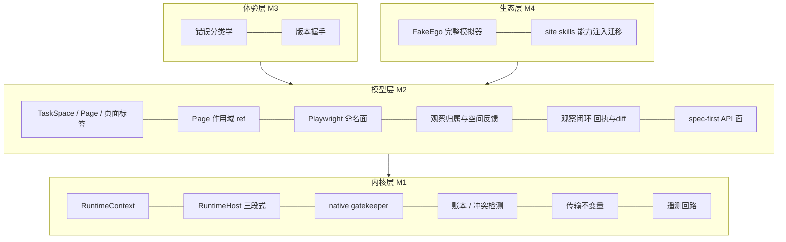

# ego-browser Runtime v2 架构设计

状态：**实施中**（分支 `2.0.0-beta-dev`；本文同时记录目标设计与当前进度）
基线：ego-browser 1.2.3（`skills/ego-browser/SKILL.md` metadata.version = 1.2.3）
适用范围：`package/ego-browser/` 运行时 + `skills/ego-browser/SKILL.md`（下一版
更新 Agent API；1.2.3 全局 helper 作为旧脚本兼容层继续保留）
读者：不需要了解设计讨论过程的实施者与评审者。本文档自包含。

文档结构（按受众导航）：

- 第一部分 总纲 —— 问题、约束、目标、四层架构、里程碑。所有人读。
- 第二部分 设计 —— §5 运行时内核、§6 持久层/并发/遥测、§7 页面模型与
  API。分别是内核实施者、并发评审、SKILL 改写者的主场。
- 第三部分 决策记录 —— 已裁决事项的索引（裁决 + 理由一句 + 正文位置）。
  评审前必读，防止复议。
- 第四部分 验收 —— M0 验证、实施顺序、验收场景、开放问题。

术语：

- **轮（round）**：一次 heredoc 提交的完整执行，进程随之生灭（SDK 路径
  为宿主的一次调用）。
- **账本（ledger）**：磁盘上按 space 存放的页面所有权记录（§6）。
- **标签（label）**：运行时为页面签发的无语义跨轮地址（`p1`、`p2`…，
  或经 `as` 自选）；space 生命周期内永不复用。
- **账外**：存在于浏览器但不在账本中的 tab。
- **收编**：把账外 tab 记入账本并签发标签，使其受运行时管理。
- **背压**：以带指引的报错拒绝超限操作，而不是静默回收。

---

# 第一部分：总纲

## 1. 背景与问题

ego-browser 是一个面向 AI Agent 的 CDP 浏览器自动化运行时。Agent 通过
`ego-browser nodejs <<'EOF' ... EOF` heredoc 提交 JS 脚本，脚本在注入了全套
helper 的 Node.js 环境中执行，驱动 ego lite 浏览器中隔离的 task space。

**触发本次架构演进的核心问题：Agent 打开网页后不知道关闭。** 长任务运行下
来，task space 里堆积几十个标签页，造成严重的性能消耗。

已尝试的手段是在 SKILL.md 中用文字规训（"scratch 页要随手关"、"结束时清
理"），效果有限。根因分析：

1. **API 不对称。** 打开是任务驱动的（`openOrReuseTab(url)`，"我要看这个
   页"），关闭却是记账驱动的（`closeTab(targetId)`，需要持有一个多轮之前
   拿到、早已滚出模型上下文的 targetId，或先 `listTabs()` 再逐个判断）。不
   对称的 API 注定被单向使用。
2. **没有跨轮的页面身份。** 现有工具面是全局函数 + 隐式"当前页"（激活
   tab），页面没有 agent 可持有的稳定地址，于是"换个内容看看"只能开新
   tab，旧 tab 无人认领。
3. **规训对抗不了结构。** 关闭意识要求模型持续做记忆和记账，而模型擅长的
   是对眼前刺激做反应。把责任压给 SKILL 文本，等于把结构问题转嫁给最不擅长
   处理它的一方。

另有一条工作流层面的硬事实，决定了生命周期设计的下限：**观察 → 决定 →
操作的最小闭环天生横跨两轮**。快照打印出来之后读它的是模型，模型的决定只
能落在下一轮脚本里。任何"页面活不过本轮"的语义都会与这个闭环正面冲突。

直接症状之下，运行时的地基同样不可靠：全局可变单例、两条各自为政的启动
路径、native 全局 task 上下文没有 JS 层门禁、磁盘状态无并发控制。任何
"在外面包一层"的修补都建立在流沙上，因此本设计的范围是**一代运行时架
构**，页面对象模型是其中的模型层。

贯穿全部设计的一条原则：**把正确性责任从使用者的纪律移回系统的结构里**。
隐式路由、需要免责声明的方法、静默过期的值、靠文档约束的行为，都是把责
任放错了地方。

## 2. 决定性的架构约束

以下事实决定了方案空间，实施者必须理解：

- **Node 运行时每轮用完即弃。** `runMain()`（`src/run.ts`）执行完脚本进
  程即退出，`src/state.ts` 单例中的 session、`preferredTargetId` 等全部蒸
  发。跨轮持久的只有：浏览器侧状态（task space、tabs）和磁盘文件。
- **浏览器底层 C++ 接口不可改变。** 可用能力见
  `docs/native-bindings-api.md`：`ego.createTab` / `ego.listTabs` /
  `ego.closeTaskSpace` / `ego.completeTaskSpace` / 原始 CDP
  （`Target.closeTarget`、`Runtime.callFunctionOn` 等）。所有设计都是这层
  之上的 JS 封装（D19）。
- **native 侧存在进程级全局"当前 task"。** 所有 task-scoped API 与原始
  CDP 发送都作用于 `ego.useTaskSpace(id)` 最近一次选择的空间（见
  `docs/native-bindings-api.md` 的 Task Context 与 CDP 章节）。JS 层必须
  对"选择空间 + 执行操作 + 等待响应"做互斥（§5.2），否则跨空间调用会落
  在错误的空间里。
- **targetId 是 GUID，tab 存活期间稳定，实际不会复用。** 这是跨轮引用和
  fail-closed 错误语义的基础。
- **关掉 task space 里的所有 tab 等价于关掉该 space**（产品语义）。任何
  关闭操作必须保底留一个 tab。
- **用户可随时接管 space**（`EGO_TASK_SPACE_USER_IN_CONTROL`）。自动账本
  动作只能在 agent 持有控制权时执行。
- **heredoc 进程可能被硬杀**（agent harness 超时、SIGKILL）。任何跨轮承
  诺都必须在 await 返回前落盘，不能依赖"脚本正常收尾"。
- **存在两条启动路径且生命周期不同。** CLI 路径走
  `runMain() → execute()`；SDK 路径（ego lite app 内嵌）只调
  `installEgoSdk()`，**不经过 `execute()`**，目前仅有进程退出事件上的输出
  flush（`src/index.ts`、`src/output-sink.ts`）。`exit` 阶段无法可靠等待异
  步浏览器清理。任何生命周期机制必须同时覆盖两条路径。
- **多个 agent 进程可能并行，各自操作不同 task space**（受支持的使用方
  式）；同一 space 被多个进程同时写入**不是**受支持场景，按检测处理
  （§6.3）。磁盘状态须对前者安全、对后者可检出。
- **agent 脚本能触达 `globalThis.ego`**（native 文档教的就是直接用）。运行
  时不能假设自己独占 CDP 通道回调（§5.4-③）。

## 3. 设计目标

1. 结构性解决标签页堆积：最坏情况有界，不依赖模型自觉，**且在进程崩溃、
   并行进程、用户干预下依然成立**。
2. **复用优先于新开**：换内容默认是原地导航，新 tab 是显式的例外；让懒惰
   路径天然不增殖。
3. 跨轮引用无感：凭标签取回页面，无显式恢复仪式；观察 → 决定 → 操作的跨
   轮闭环天然成立。
4. 一切自动机制不伤害用户：用户开的页、用户在看的页、handoff 期间用户碰过
   的页，运行时永不自动关闭。
5. 错误 fail-closed：过期引用宁可报错，绝不静默指向错误的页面、元素或空
   间。
6. 并发正确：跨 space 并发调用、多 agent 进程并行、崩溃，语义均有明确定义
   且被测试覆盖。
7. **最大化利用模型先验**：命名、参数形状、单位与 Playwright 等主流工具对
   齐，但仅在语义真正一致时（§7.8 铁律）。

## 4. 四层架构与里程碑



里程碑（执行计划以此为骨架）：

- **M0 —— 先行验证（go/no-go 门禁）**：§10.1 的三个 native 行为 spike。不
  通过则相应部分回退讨论（降级预案见该节）。
- **M1 —— 内核与持久层**：RuntimeContext、RuntimeHost、gatekeeper、传输不
  变量、账本/冲突检测、遥测回路。完成标准：不含 agent 面变化；冲突检测
  与崩溃持久性单测通过（kill -9 后已落盘页跨轮可取）；`npm test` 全绿。
- **M2 —— 模型层与 SKILL**：Page/TaskSpace、页面标签、Page 作用域 ref、
  Playwright 命名面、`evaluate`、console 输出通道、观察闭环、spec-first
  API 面、反馈行、SKILL 重写（版本升 major）。完成标准：§10.3 全部验收场
  景通过；`npm run e2e` 全绿。
- **M3 —— 体验层**：错误分类学、版本握手。独立排期。
- **M4 —— 生态层**：测试模拟器完善、site skills 迁移。

M1 与 M2 文档、验收、评审可独立，持久层可并行开发。

---

# 第二部分：设计

## 5. 运行时内核（M1）

现有 drivers、事件队列、session、ref 状态大量依赖全局单例
（`src/state.ts`、`src/browser-runtime.ts` 模块级 `events`/`pending`/
`pendingDialogs`），不能仅靠外面包一层 Page。以下是模型层的前置工程。

### 5.1 RuntimeContext 取代全局单例

一个进程一个 `RuntimeContext`，持有 CDP 传输、per-target session 缓存、
per-target 事件缓冲、ref 解析表（§7.6）、账本连接与 round 身份。
driver 函数签名显式接收页面上下文（spaceId + targetId + sessionId），不再
读全局。`__testing.setOverrides` 相应改为注入 context。

### 5.2 native gatekeeper

- `ego.useTaskSpace(id)` 是进程级全局选择（§2），因此设进程级异步互斥：
  所有 task-scoped native 调用与 CDP 发送以
  `withSpace(spaceId, async () => { ego.useTaskSpace(id); ...op })` 临界
  区执行。Page/TaskSpace 携带 immutable spaceId，每次操作经 gatekeeper
  路由。
- **互斥覆盖完整请求生命周期**：从发送到响应落地（或超时）。串行一次性
  执行公理（D20）下，切换 space 时按构造不存在在途请求。
- **跨 space 的 `Promise.all` 串行化执行**（D11）；同一 space 内操作亦串
  行，与 native 单通道模型一致。
- **复合操作同临界区**：需要激活页面的操作以"切换激活 → 页面操作"执行，
  两步必须在同一临界区内完成，其间不允许插入其他操作（具体规则见 §7.4）。

### 5.3 RuntimeHost 生命周期契约

`beginRound` / `run` / `finalizeRound` 三段式，CLI 与 SDK 共用同一实现：

- `beginRound()`：生成 round UUID、加载账本并记录冲突检测的基准版本
  （§6.3）。
- `finalizeRound()`：批量更新 `lastUsedAt`、写遥测（§6.4）、flush 输出与
  轮末报告。
- **持久性是逐操作的**：`newPage` / `adopt` / `close` 的 await 返回即落盘
  （§6.3），不依赖 finalizeRound。因此宿主不 await finalize（当前 ego
  lite 的 SDK 路径即如此）只损失遥测与报告，不产生任何泄漏或欠账。
  `beforeExit` 上保留 best-effort 尝试。此契约写入
  `docs/local-runtime-development.md`。

### 5.4 传输不变量（CDP 加固）

"串消息"的病根是隐式路由（隐式 space、隐式 session、隐式单通道），与模型
层要消灭的"隐式当前页"同种（D3、D16）。五条不变量：

1. **无隐式 space 路由**：所有发送经 gatekeeper，互斥覆盖发送到响应落地
   （§5.2）。
2. **无隐式 session 路由**：session 按显式 targetId 附着与缓存
   （`pendingDialogs`/`pageEnabledSessions` 已按 session 分键，结构可承
   接）。1.2.3 的"按激活 tab 附着 + 2s TTL"存在真实的跨 tab 串命令风险
   （两次调用之间用户切换激活 tab），v2 根治。**多 session 附着是最大技术
   风险点，M0 验证项 ①。**
3. **响应处理器防踩踏**：`onCDPMessage`/`onSendCDPMessageError` 安装一次并
   保护；检测到被外部覆盖时显式报错（agent 脚本能触达 `globalThis.ego`，
   §2）。SKILL 明确禁止脚本直接操作 ego 的 CDP 通道。
4. **单在途不变量（INV-1）**：全进程至多一个在途 native 请求。这使
   `handleSendError` 的"无 id、广播 reject"语义安全，A 空间的
   user-control 错误不会误伤 B 空间的在途请求。
5. **重试白名单**：session-lost 自动重发仅限观察/查询类命令；动作类命令
   （`Input.*` 等非幂等操作）失败即如实报错，杜绝双执行（双击、重复提交）。

配套：CDP 超时从固定 15s 改为按调用可配（`page.cdp(..., { timeout })`，毫
秒），默认值保留。

事件模型：全局 `events` 数组按 sessionId → targetId 路由为 per-page 缓冲
（每页独立上限），`page.events()` 取用；无归属的 browser 级事件入 context
级缓冲。

## 6. 持久层与并发（M1）

### 6.1 定位

**账本是标签、出身、页面归属的权威事实来源；浏览器是页面存在性的权威事
实来源。** 一旦标签解析、预算、handoff 归因依赖账本，它就是权威状态而非
缓存（D5）。丢失时**安全降级**：账本丢失 → 标签失效、所有页面变为账外 →
`task.page(...)` 报错、运行时本就不自动关页（§7.2 规则三）→ 模型经
`listPages()` 重新收编。降级方向是"不清理"而不是"误清理"。不设 TTL 主动
丢弃；桶只在确认 space 不存在时（对 `listTaskSpaces()` 核实后）删除，
`task.close` / `task.finish` 显式处理。

### 6.2 存储位置与结构

- 位置：`~/.ego-browser/state/`。**不放 agent workspace**：默认 workspace
  可能解析到 app 安装包内的打包 skill 目录（`dist/out/ego-browser`），应用
  更新会整体替换且可能不可写；同时维持"workspace 只放人和 agent 维护的知
  识/配置，运行时自产状态走独立目录"的边界。
- 每 space 一个账本文件 `space-<id>.json`（缩小写冲突面与检测粒度）：

  ```json
  {
    "spaceId": 7,
    "version": 12,
    "writerRound": "0198c2f1-...",
    "nextLabel": 4,
    "usedLabels": ["p1", "p2", "p3", "login"],
    "initialized": true,
    "unmanagedTargets": { "USER...": "user" },
    "pages": {
      "p1":    { "targetId": "A3F0...", "openedBy": "agent",
                 "openedAt": 1755451100000, "lastUsedAt": 1755451200000 },
      "login": { "targetId": "B71C...", "openedBy": "agent",
                 "openedAt": 1755451300000, "lastUsedAt": 1755451900000 }
    },
    "handoffBaseline": { "at": 1755450000000, "targetIds": ["..."] },
    "touchedAt": 1755451900000
  }
  ```

  `nextLabel` 驱动自动标签的单调分配；`usedLabels` 记录已用尽的标签（含
  自选），保证 space 生命周期内永不复用、死标签 fail-closed。
  `unmanagedTargets` 记录首次接管时已经存在的页面，以及显式 `release` 后
  仍保留的页面，避免后续对账把它们误认成 Agent 新开的页面。
- 读路径顺带剪枝：加载账本后对 `listTabs()` 校验，targetId 已死的条目剪
  掉（标签进入 `usedLabels` 保留）。targetId 为 GUID 不复用，过期条目最坏
  "指向不存在的东西"，fail-closed，永不误指新 tab。

### 6.3 并发与崩溃

真实并发形态是**多 agent 各自操作不同空间**；同一空间被两个进程同时写入
不是受支持的使用方式。持久层据此按"单写者 + 冲突检测 + 冻结"设计，不设
跨进程互斥（D21）：

- **round 身份**：每轮启动生成 round UUID，作为账本写者标识
  （`writerRound`）。
- **原子写**：账本更新走"读-改-写 + 临时文件 + 原子 rename"，防半写文
  件。**持久是逐操作的**：`newPage` / `adopt` / `close` 的 await 返回以账
  本落盘为准，不攒到轮末。
- **冲突检测**：账本携带 `version`（单调递增）与 `writerRound`（§6.2）。
  轮内首次读取记住版本；每次写入前重读校验，发现版本被其他 round 推进即
  为检出竞争。检出后：本空间的自动账本动作冻结（popup 收编停用），输出明
  确警告（"另一进程正在操作此空间"），显式操作照常执行
  （last-writer-wins，可见而不静默）。
- **没有 WAL，没有恢复扫描**：页面创建即持久、无轮末回收，崩溃后不存在
  "欠下的清理"——已落盘的页本来就该活着，持久是承诺而不是泄漏。唯一的崩
  溃残余是 `createTab` 已成功、标签尚未落盘的窗口（§7.2），按来源不明保
  留并遥测。这不是省略：清理义务本身消失了。

### 6.4 遥测回路

本设计多处决策以"有数据再议"挂起（预算默认值、来源不明 tab 等），数据来
源在此。M1 起运行时在状态目录追加写 `~/.ego-browser/state/metrics.jsonl`，
每轮一行轻量指标：本轮开/关页数、popup 收编数、预算命中、闲置页数（带标
签与闲置轮数）、ref 失效次数、space 内 tab 总数、space 内来源不明 tab 数
（账外 tab）、快照输出体量（全量/diff 各自的字节数）、每任务累计轮数、轮
次耗时。仅本地追加写、无上报；写入失败静默，遥测永不影响主流程。§11 中
所有"按真实任务调参"的开放问题以此为数据来源。

## 7. 页面模型与 API（M2）

### 7.1 API 全貌

所有页面操作挂在句柄上。无隐式当前页，无隐式当前空间，无 Proxy 魔法。
**所有时间参数与选项均为毫秒**（D14）。

```js
// —— 全局 helper ——
const task = await taskSpace('compare prices')     // get-or-create（原 useOrCreateTaskSpace）
const task2 = await claimTaskSpace(9)              // 收养用户 space（所有权转移，郑重动词保留）
await listTaskSpaces()
await wait(500)                                    // 毫秒
const response = await fetch(url, {                 // Node 22 标准 fetch，不是 helper
  signal: AbortSignal.timeout(15_000),
})
console.log(...); help(name)                       // 输出通道见 §7.10

// —— TaskSpace 对象 ——
const p1 = await task.newPage(url, { timeout })    // 开页：运行时签发跨轮标签（p1, p2…），返回即落盘
const lg = await task.newPage(url, { as: 'login' })// 自选标签，与自动标签同一命名空间（可选）
const p  = task.page('p1')                         // 凭标签跨轮取回（懒句柄，首次 await 校验，见 7.4）
const cur = task.userPage()                        // claim/takeOver 那一刻用户正看着的页（边界捕获，见 7.5）
const all = await task.listPages()                 // 盘点：{page, label?, title, url, active, openedBy}
const ad  = await task.adopt(cur, { as: 'order' }) // 收编账外页（用户页/未知页）→ 签发标签入账
await task.release('p5')                           // 解除收编（仅用户出身页；agent 页走 page.close，见 7.4）
await task.handOff(); await task.takeOver()
await task.waitForControl({ interval, timeout })   // 毫秒（原 waitForAgentControl）
await task.finish()                                // 完成：在账页面全部留给用户（返回保留清单）
await task.close()                                 // 销毁整个 space（原 complete {keep:false}）
await task.cdp(method, params, { timeout })        // Target./Browser. 级 CDP，经 gatekeeper
task.id; task.name; task.ownership                 // 只读元数据

// —— Page 对象 ——
await page.goto(url, { timeout })                  // 复用原语：原地覆盖，不新开 tab（§7.2）
await page.snapshot(options)                       // 原 snapshotText；头部含归属与空间状态（7.7）
await page.screenshot(path?, options)
await page.click(sel, { position: {x, y} })        // 仅选择器；坐标点击走 page.mouse
await page.dblclick(sel); await page.hover(sel)
await page.dragAndDrop(srcSel, dstSel)
await page.fill(sel, value)                        // 原 fillInput
await page.setInputFiles(sel, path)                // 原 uploadFile
await page.mouse.click(x, y); await page.mouse.wheel(dx, dy)   // 原坐标 click / scroll({dy})
await page.mouse.down(); await page.mouse.move(x, y); await page.mouse.up() // 坐标拖拽原语
await page.keyboard.press('Enter')                 // 原 pressKey
await page.keyboard.type('hello')                  // 原 typeText
await page.keyboard.dispatch(...)                  // 原 dispatchKey（底层）
await page.scrollBy(px)                            // DOM 滚动（无先验可借，保留自有名）
await page.scrollToBottomUntil(fn, { step, wait, maxSteps })   // wait 为毫秒
await page.evaluate(fnOrString, arg)               // 单个 JSON 参数，见 7.9；原 js()
await page.cdp(method, params, { timeout })        // 本页 session 上的 CDP
await page.info()                                  // 视口/滚动等状态总览（实时）
await page.url(); await page.title()               // 实时异步读取（无静默陈旧属性，见 7.4）
await page.fetch(url, options)                     // 页面内 window.fetch 的便捷封装（见 7.4）
await page.waitForSelector(sel, { timeout })       // 原 waitForElement
await page.waitForLoadState('load' | 'networkidle', { timeout })  // 原 waitForLoad / waitForNetworkIdle
await page.events()                                // 本页事件缓冲（原全局 drainEvents 的页面化）
await page.close()                                 // 关闭并除账（标签进入 usedLabels，永不复用）
page.targetId; page.spaceId                        // immutable
page.label; page.openedBy                          // 账本视图
```

selector 表面：raw CSS、`xpath=`、`loc=...` 与 1.2.3 一致；ref 见 §7.6。

**从新版 Agent 面移除的名字**：`openOrReuseTab`（→ `newPage` 或对既有页 `goto`）、
`closeTab`、`switchTab`、`gotoUrl`、`gotoAndWait`、`currentTab`、
`ensureRealTab`、`pageInfo`、`js`、全局 `cdp`、全局 `drainEvents`、
`snapshotText`、`captureScreenshot`、`fillInput`、`uploadFile`、
`pressKey`、`typeText`、`dispatchKey`、`doubleClick`、`dragMouse`、
`scroll`、`useOrCreateTaskSpace`（→ `taskSpace`）、`completeTaskSpace`
（→ `finish`/`close`）、`serverFetch`（→ Node 标准 `fetch`）、`browserFetch`
（→ `page.fetch`）、`cliLog`（→ `console`，作为 legacy helper 保留，§7.10）、
`waitForAgentControl`（→ `task.waitForControl`）。driver 层实现保留为内部模
块，供 Page 方法委托。

这里的“移除”只表示它们不进入新版 API schema、默认 `help()` 清单和
SKILL。为避免线上自动脚本因运行时升级而失效，1.2.3 的全局 helper 仍按原
参数、返回值、单位和错误语义注入脚本作用域；显式
`help('legacyName')` 也继续可用。它们组成独立的 legacy compatibility
surface，不新增能力；新脚本不要在同一轮混用新旧接口。完整策略见
[`legacy-api-compatibility.md`](legacy-api-compatibility.md)。

### 7.2 页面生命周期：标签、复用、预算

页面与元素同构：**运行时签发无语义地址，身份放在系统里**（D22，与 §7.6
的 ref 同一哲学）。区别一句话：元素 ref（`@N`）来自某次页面快照，页面标
签（`pN`）则是长期身份。ref 不持久化；跨进程使用时会先重拍同一个 Page 来
恢复映射（§7.6）。

生命周期只有三个事实：

- **创建即持久**：`newPage` 原子序列为 `createTab` → 签发标签 → 账本落
  盘，await 返回即持久化；此后任何一轮凭 `task.page('pN')` 取回。不存在
  匿名页，不存在轮末回收，不存在"打开时表态生死"——观察 → 决定 → 操作的
  跨轮闭环（§1）因此天然成立。
- **复用即 goto**：`page.goto(url)` 原地覆盖，是默认的"换内容"方式；新开
  tab 是显式的例外。标签在 space 生命周期内永不复用（自动与自选同规
  则），死标签 fail-closed。
- **关闭永远显式**：`page.close()`（自动除账）、`task.close()`（销毁
  space），或用户手关（账本读时剪枝，后续使用报错）。运行时不存在任何静
  默关页的路径（D1）。

**崩溃残余窗口**：`createTab` 在浏览器内已成功、标签尚未落盘时被硬杀，会
留下一个账面查无此页的 tab。处理：视为来源不明并保留，不做自动清理；遥
测计数（§6.4）。数据证明其成为实际问题时再议原生接口（D19）。除此之外崩
溃无需任何恢复动作（§6.3）。

**轮内账外新 tab 的收编（堵住 popup 逃逸口）**：可能打开新 tab 的 Page
操作在执行前后各取一次 `listTabs()`，把差集中的新 tab 签发标签入账。当前
实现已覆盖 `click` / `fill`；`evaluate` 等其余入口还要接入同一动作边界，
轮末再做一次兜底对账。既有账外 tab 不碰。边界仍是 agent 自有且持有控制权
的空间；handoff 期间的新 tab 由基线机制归因（§7.3），不收编。收编后的
popup 与普通页无异：占预算名额、出现在动作回执与头部中，不要则显式
`close()`。

三条面向模型的生命周期规则（SKILL 原文教学）：

1. **页面有跨轮标签。** 输出头部里的 `p1`/`p2` 就是地址，下一轮
   `task.page('p1')` 取回。标签没有含义，所以不会过期成谎言；内容看旁边
   的标题。
2. **换内容用 goto，别开新页。** 一个页可以反复导航复用；只在需要多页并
   存对照时才 `newPage`。
3. **账外的页不碰。** 用户的页只有显式 `adopt` 后才受管理；运行时永不自
   动关闭任何页面。

设计意图：防膨胀既不依赖"记得关"（纪律），也不依赖轮末回收（机制杀页，
且与跨轮闭环冲突），而是让**懒惰路径天然不增殖**——复用比新开更顺手，加
上预算闸门（§7.3）与头部可见性（§7.7）结构性封顶。地址不承担语义，语义
由标题行与模型自己的上下文承担：内容名会腐烂、职责名很业务，无意义的名
字不可能变错。

### 7.3 守护规则

以下规则的"检查后行动"序列在轮内串行执行（D20），并受冲突冻结约束
（§6.3）：

- **最后一 tab 保底**：`page.close()` 目标是 space 最后一个 tab 时，先开
  `about:blank` 再关目标。space 的生死只归 `task.close` / `task.finish`。
- **页面预算（背压，非静默回收）**：每 space 在账页面上限默认 8（`.env`
  可配）。满额时 `newPage` / `adopt` 抛错，错误自带决策上下文：

  ```text
  Page budget reached (8/8) in this space:
    p1     "京东商品页"     active
    p2     "拼多多商品页"   idle 1 round
    login  "飞书登录"       idle 5 rounds   <- consider closing or reusing
  Close: await task.page('login').close()
  Reuse: await task.page('login').goto(url)
  ```

  popup 收编不受闸门阻拦（页已存在，拒收只会造成账外堆积），可短暂越额；
  越额期间 `newPage` 持续背压，直到降回限内。
- **Agent 控制期间的新 tab 自动入账**：第一次取得控制权时，先把当时已经
  存在、尚未入账的 tab 记入 `unmanagedTargets`。此后只要 Agent 仍持有控制
  权，任何新出现且不在 `pages` / `unmanagedTargets` 中的 tab 都由对账流程
  自动签发标签。动作后的短暂 tab 差分只负责尽快生成回执；即使 popup 出现
  得更晚，下一次 Page 操作、`listPages()` 或下一轮初始化也会补收编。
- **用户控制权**：收编等自动账本动作仅在 agent 持有控制权时执行，无控制
  权则跳过并静默（下轮重试）。
- **handoff 归因基线**：`task.handOff()` 时在账本记录当时的 tab 集合。用
  户控制期间无法观察（native 拒绝所有查询）；`takeOver()` 时对
  `listTabs()` 做差集：新出现的 tab 记 `openedBy: 'user'`，**不自动收
  编**，由 `listPages()` 呈现给模型决定 adopt 与否。
- **`task.finish()` 不清扫**：在账页面全部原样留给用户，返回保留清单。没
  有匿名类别就没有清扫义务；要收拾的页在 finish 前显式 `close()`。

### 7.4 语义细则

- **页面激活**：`snapshot`、`screenshot`、`click`、`fill`、`evaluate`、
  `fetch` 在操作前激活目标 Page，并让它保持激活；`url`、`title`、`info`
  这类纯读取不激活页面。Agent 操作的是自己的 task space，切换不会抢走用户
  所在空间的前台页面，但页面仍会收到 `visibilitychange`，也可能恢复计时器
  和站点打点。这是为了让截图、输入、脚本和页面请求都发生在正确的目标文档
  中。
- **指针动作的最低可用性检查**：激活后若目标元素不在视口内，先将它滚入视
  口，再重新计算坐标并发送输入。真实环境已经证明，直接点击后台或视口外元
  素可能超时并走 `isTrusted=false` 的合成事件兜底；这一基础滚动必须实现，
  更完整的稳定、可用、无遮挡检查可后续增加。
- **输入路径保持一致**：`click` / `fill` 继续复用现有 driver；正常路径仍
  通过 CDP Input 发送鼠标或文本事件。激活和滚动只负责把目标放到正确的执行
  条件下，不另造一套站点事件序列。旧的 v1 helper 不改。
- **两种网络请求**：后台请求直接使用 Node 22 标准 `fetch()`，不再提供
  `serverFetch` helper。`page.fetch(url, options)` 是我们的便捷扩展，内部等
  价于在该 Page 中执行 `window.fetch`，因此使用页面的 URL、Cookie、Origin、
  CORS 和 Service Worker 环境。它的 `timeout` 使用毫秒，返回可跨 CDP 传递
  的普通对象：

  ```js
  { ok, status, statusText, url, headers, body }
  ```

  `headers` 是字符串键值对象，`body` 是文本；非 2xx 响应仍返回这个对象，
  不自动抛错。`signal` 不跨 CDP 传递，调用方统一使用毫秒制 `timeout`。它不
  是 Playwright 的
  `page.request.fetch()`；后者是共享 BrowserContext Cookie 的后台 API 客户
  端，不是真正从页面发出的请求。
- **标签不可变**：没有改名操作。自选标签与已用标签冲突（含已死标签）当
  场报错；想换助记名，唯一途径是开新页或收编时重选。
- **跨 space 收编**：`page.spaceId` immutable；`taskA.adopt(pageOfB)` 抛
  错。
- **`close()` / `finish()` 之后**：TaskSpace 句柄进入 dead 状态，其上所有
  方法（含已取出的 Page 句柄方法）抛 `task space completed`。
- **元数据诚实性**：句柄上只保留不变量（`targetId`/`spaceId`）与账本持有
  的字段（`label`/`openedBy`）作为属性；url/title 等实时信息一律走异步方
  法（`page.url()` / `page.title()` / `page.info()` / `task.listPages()`），
  **不存在静默陈旧的属性**。
- **懒句柄错误时机**：`task.page('p3')` 本身不报错；首次 await 方法时解析
  并校验，页已死则抛 `page p3 was closed`（并剪账，错误信息含下一步指
  引）。错误后移是懒取用换无感的已知代价。
- **thenable 防误**：`adopt(thenable)` 当场抛
  `TypeError: await the page before adopting`。

### 7.5 用户页面场景（发现与收编）

- 页面在用户自己的 space：沿用既有所有权政策（用户确认后
  `claimTaskSpace(9)`），然后 `task.userPage()` 拿到**接管那一刻**用户正看
  着的 tab，`await task.adopt(cur, { as: 'order' })` 收编入账。
- handoff 期间用户在 agent space 开了页：`takeOver` 后
  `task.listPages()` 发现。返回项含
  `openedBy: 'agent' | 'user' | 'unknown'`（出身由账本 + handoff 基线推
  断；账外且无法归因的记 `unknown`，按用户页对待）。
- **`userPage()` 是边界捕获而非实时查询**：`claimTaskSpace` / `takeOver`
  执行时由系统自动记录激活页，那一刻"激活 tab = 用户注意力所在"是真命
  题。不提供实时查询的 `activePage()`：激活态在 agent 一操作后即失真，
  正确使用需要"只在轮次开头可信"的免责声明，而需要使用者自律才正确的
  API 是把责任放错了地方。想知道"现在哪个 tab 激活"，诚实来源是
  `listPages()` 的 `active` 字段。

### 7.6 ref：由 Page 提供作用域

原生 snapshot 已为元素提供 `backendNodeId`，内容中显示为 `[ref=N]`；操作时
仍接受熟悉的 `@N` / `ref=N`。v2 不再给它套第二层编号，而是按 targetId 分开
保存 ref map：

- `page.snapshot()` 只替换该 Page 的 ref map，不影响其他页面。
- `page.click('@21')` / `page.fill('@21', value)` 只在该 Page 的 session 中解
  析和操作，绝不落到当前激活的其他 tab。
- 新进程里 map 为空，或指定 ref 不在 map 中时，运行时先自动重拍同一个 Page
  一次；新快照仍没有该 ref 才报 `Unknown ref`。因此上一轮 snapshot 中的 ref
  可以直接用于下一轮，但页面结构已经变化时会如实失效。
- `goto`、`evaluate`、`click`、`fill` 后清空该 Page 的 map，下次 ref 操作会
  重新观察，避免继续使用动作前的 DOM 记录。不引入 snapshot generation
  （D4）。

`@21` 字符串本身不携带页面身份。如果 p1 和 p2 都有 `@21`，
`p2.click('@21')` 就表示 p2 当前快照里的 `@21`；系统无法判断调用方是否从
p1 复制了这个字符串。这里的作用域来自 Page 句柄，而不是 token，文档不再承
诺做不到的 `belongs to page` 检测（D12）。跨较大 DOM 变化复用元素仍优先用
`loc=...`。

### 7.7 环境反馈

`page.snapshot()` 输出头部注入归属与空间状态：

```text
[p2 "拼多多商品页 - 拼多多" | space "耳机比价"(7): 3 pages — p1 "京东商品页", p2*, login "飞书登录" idle 4r]
```

多页并存后**每一份观察输出必须自报出处页**（截图的输出路径行同理），
否则模型会混淆多页观察结果。闲置页带"idle Nr"标记（按账本 `lastUsedAt`
按轮计），把"该关谁、该复用谁"从记忆任务变成刺激-响应任务；接近预算上限
时头部升级为显式警告。模型对观察结果里的信息的响应远好于对 SKILL 规训的
遵守。

**实现注记**：v1 原生 snapshot 作用于当前激活 tab，所以
`page.snapshot()` 在同一 gatekeeper 临界区内先激活目标再拍摄。截图、输入
和 `evaluate` 也采用同一激活规则（§7.4）。多页轮询因此是串行切换，成本随
页数线性。

### 7.8 命名规范：借先验的铁律

命名就是在选择调用哪部分训练先验。铁律（D13）：

> **只在语义真正一致（含参数形状与单位）时借名。语义不同还借名，先验就从
> 资产变成负债。**

1.2.3 中的两个反面教材：SKILL 需要整段警告"不要把 `js()` 当
`page.evaluate` 用"（名字引来了错误联想，文档在替它打补丁）；`wait(秒)` 若
叫 `waitForTimeout` 会让先验写出 `waitForTimeout(1000)` 等 16 分钟。

**借（语义已对齐或本次修到对齐）**：`goto`、`click`（仅选择器 +
`{position}` 偏移）、`dblclick`、`hover`、`dragAndDrop`、`fill`、
`setInputFiles`、`screenshot`、`waitForSelector`、`waitForLoadState`、
`page.mouse.*`（坐标操作）、`page.keyboard.*`（键盘操作）、`newPage`（创
建页面语义一致；跨轮标签是自有扩展，不构成先验冲突）、`evaluate`
（§7.9）、`page.url()` / `page.title()`。click 的多态参数（string /
[x,y] / {x,y} / {selector,x,y}）随之拆除：选择器走 `page.click`，坐标走
`page.mouse.click`，与先验的分工完全一致。

**不借（语义有距，名字保持距离就是保持安全距离）**：

- `cdp()`：Playwright 对应物是 `newCDPSession().send()`，借一半更乱；保留
  自有名，形态为作用域显式（`page.cdp` / `task.cdp`）。
- `snapshot()`：自有概念（语义快照 + ref），无先验可借，去掉 `Text` 赘词
  即可。
- `task.page(label)`：跨轮页面寻址是自有概念（Playwright 无进程会死的问
  题），保留自有形态。
- `scrollBy` / `scrollToBottomUntil`：DOM 滚动便利函数，Playwright 无对应
  物，保留自有名。
- `page.fetch()`：Playwright 没有从页面直接发起 fetch 的同名方法；它是
  `page.evaluate(() => window.fetch(...))` 的便捷封装，不借
  `page.request.fetch()` 的名字和语义。
- **locator 链不借**：`page.locator(sel).click()` 的惰性链在 heredoc 短命
  进程、扁平调用的模型下没有收益；借的是词汇和参数形状，不是对象代数。

**TaskSpace 词汇不借 context**：TaskSpace 最接近 `BrowserContext`，但它有
ownership、handoff、takeover 这些 context 完全没有的语义，借名会引来"context
是我的、随便关"的错误先验，恰好破坏最在乎的控制权规则。task 一族保持自有
动词（`handOff`/`takeOver`/`finish`/`close`），只修真正丑的：
`useOrCreateTaskSpace` → `taskSpace(nameOrId)`（名词式 get-or-create）。
`claimTaskSpace` 保留全名：所有权转移是郑重动作，值得一个郑重的动词。

**单位（D14）**：新版 Agent API 统一毫秒，不存在"参数默认秒、Ms 后缀毫
秒"的双轨制。借来的名字自带毫秒先验（`{ timeout: 5000 }` 就是 5 秒），
混合约定是地雷；且 API 的写作者是模型，模型的单位直觉是毫秒。Legacy API
为保证旧脚本兼容，继续保持 1.2.3 的单位约定。新版 SKILL 相应删除单位
caveat。

### 7.9 evaluate：函数加一个明确的参数通道

1.2.3 的 `js()` 是字符串求值（`Runtime.evaluate`），无参数通道，这是实现
选择而非底层限制。v2 增加函数形态和一个明确的参数通道，调用形状与
Playwright 一致，但参数只支持 JSON（D15）：

```js
await page.evaluate(([sel, n]) =>
  [...document.querySelectorAll(sel)].slice(0, n).map(el => el.innerText),
  ['article', 20])                                  // 只有一个显式参数
await page.evaluate(String.raw`document.title`)     // 字符串表达式仍支持
```

- 函数形态走 `Runtime.callFunctionOn`，在页面全局对象上执行，等待 Promise
  并按值返回结果；字符串形态走 `Runtime.evaluate`，不接受第二个参数。
- 函数不捕获 Node.js 闭包。参数必须严格 JSON 可序列化；`undefined`、函数、
  `Symbol`、`BigInt`、`NaN` / `Infinity` 和循环引用会明确报错。这是有意缩小
  的子集，不宣称完整复刻 Playwright 的序列化能力。
- 执行前先激活目标 Page。`evaluate` 可以改 DOM、发请求或打开窗口，不按纯
  读取处理。
- 收益：1.2.3 SKILL 中"js() 不是 evaluate"、"正则反斜杠双写"、"top-level
  return 自动包 IIFE"等整段补丁文档全部删除。
- 真实 Ego Lite 回归已覆盖大体量嵌套参数、Unicode 与转义字符、异步函数、
  批量 DOM 写入、CustomEvent、嵌套返回值和后续重新读取。

### 7.10 输出通道：console 即标准输出

`cliLog` 的名字描述的是输出管道而非语义；它的真实语义（把内容写到脚本调
用方能看到的输出里）正是 `console.log` 在模型先验里的确切语义，而最高频
的操作应当借最强的先验（D17）。1.2.3 中模型顺手写 `console.log` 会绕过
缓冲 sink 直通 stdout，硬停时无法丢弃，是一处静默的行为分叉；v2 把
console 定为正式通道：

- 每轮执行时注入 round 级 `console` 对象遮蔽全局：`log`/`info`/`warn`/
  `error` 全部走可丢弃的缓冲 sink（`warn`/`error` 加前缀标记），对象格式
  化沿用 `formatCliLogValue`。硬停丢弃语义不变（D10）。round 级注入避免
  污染全局，并让每轮的 console 天然绑定到该轮的输出流。
- `cliLog` 作为 v1 脚本兼容接口继续可用，但不进入新版默认 help 清单和
  SKILL。兼容接口不在 2.x 中单独移除，也不向脚本输出逐次弃用警告。

### 7.11 观察闭环：动作回执与快照 diff

每轮 heredoc 的真实成本是一次模型往返，因此本 API 的核心 KPI 是**每轮返
回的信息够不够模型决定下一轮**。这是本设计存在意义的一半，不是锦上添
花；两项能力属于模型层（M2）交付内容：

- **动作回执**：`click`/`fill`/`goto` 等返回轻量摘要（是否触发导航、弹
  窗、新 tab 收编、明显 DOM 变化），减少"操作一轮、观察一轮"的往返。当前
  `click` / `fill` 对动作结束时已经可见的 popup 返回
  `{ popups: [{ label, targetId }] }` 或 `{}`；出现得更晚的 popup 由统一对账
  补收编，不依赖动作回执维持生命周期正确性。导航和 DOM 变化摘要还未实现。
- **快照 diff**：`page.snapshot({ diff: true })` 返回与该页上一次快照的
  差异而非全量重发。全量快照是最大的 token 消耗方，diff 对长任务的成本
  改善是数量级的。diff 基线按 targetId 维护于运行时；基线缺失时自动退化
  为全量并在头部注明，fail-open 到更多信息而非更少。**已知边界**：基线
  不落盘，"每轮一进程"下跨轮首次快照必然全量，diff 只在轮内生效；若遥测
  显示长任务的全量快照成本仍然显著（§6.4 快照体量口径），再评估基线落
  盘。

### 7.12 spec-first API 面

当前 Agent 可见的 API 有三份平行真相：helpers 实现、`help()` 的运行时
JSDoc 解析、SKILL.md 的手写 API 参考，靠人肉同步（AGENTS.md 中 "keep
SKILL.md in sync" 的叮嘱即其自白）。v2 改为单一来源：

- 一份带类型与文档的 API schema（TS 类型 + 结构化描述）生成三样东西：
  `help()` 输出、SKILL.md 的 API 参考章节、运行时参数校验（毫秒单位、必
  填项、枚举值）。
- 三者从机制上不可能漂移；schema 变更即 API 变更，评审只看一处。
- help() 随之构建期化：构建期从 schema 生成 help manifest，取代运行时
  acorn 解析，对类方法与子对象（`page.mouse.*`）也更稳。
- schema 只描述新版 Agent API。脚本执行上下文由新版 API 与 legacy
  compatibility surface 合并而成；默认 `help()` 清单和 SKILL 只读取前
  者。legacy surface 由冻结清单、显式名称查询用的冻结 help manifest 和
  v1 脚本回归测试约束，不参与新版文档生成。

## 8. 体验层（M3）

不阻塞 M2 交付，按价值排序：

1. **错误分类学**：把 `ego-errors` 已有的 owned-guidance 模式推广到全部运
   行时错误，每个 agent 可见错误带稳定 code + 一行"下一步建议"。错误就是
   agent 的 UX。
2. **版本握手**：运行时暴露 apiVersion（`--doctor` 与输出 banner），SKILL
   front-matter 锁定所需版本，失配时输出警告。取代
   `docs/local-runtime-development.md` 中人肉对齐的叮嘱。
3. **更完整的 auto-wait / actionability**：激活和滚入视口属于 Page 点击
   的基础要求（§7.4）；元素稳定、可用、无遮挡等更完整检查后续再评估。

## 9. 生态层（M4）

1. **测试模拟器**：FakeEgo 升级为完整模拟器，覆盖多 space/tab、控制权转
   移、`useTaskSpace` 全局语义、崩溃注入、双进程并发。§10.3 的对抗场景没
   有它无法自动化。
2. **site skills 迁移**（原称 learnings，D18）：现有 site skills 暂走 legacy
   compatibility surface；新版站点工具再迁为显式接收 Page 句柄（能力注
   入），manifest 声明所需 runtime apiVersion。本次不强制迁移（D6）。

---

# 第三部分：决策记录

已裁决事项的索引：裁决 + 理由一句 + 正文位置。**修改需重开评审**，不要在
实施或后续评审中隐式复议；完整机制以正文为准。

- **D1 否决一切静默关页（永久）。** 自动关闭 agent 可能还要用、用户可能正
  在看的页比堆积更糟；资源上界一律用背压实现。→ §7.2、§7.3
- **D2（已被 D22/D23 取代）** 原"命名即保留"裁决随命名仪式取消而废止；其
  目标（有界持久）由标签制 + 预算闸门达成。
- **D3 拒绝一切"隐式当前 X"。** 隐式当前页是本次问题的根源之一，其回潮形
  态（全局容器、委托层、隐式 session/space 路由）一并否决。→ §5.4、§7.1
- **D4 不引入 snapshot generation。** backendNodeId 跨快照稳定是既有承
  诺；页内陈旧性维持"最新快照"规则。→ §7.6
- **D5 账本是权威所有权账本，不是可丢弃缓存。** 丢失定义为安全降级，方向
  是"不清理"。→ §6.1
- **D6 site skills 不进入新版 Agent API 委托层。** 既有工具随 legacy
  compatibility surface 保持可运行；新版工具以后显式接收 Page 句柄。→
  §9、§10.4
- **D7 task space 不做隐式选择。** space 是用户可见的所有权边界，自动恢复
  "上次 space"在多任务并行时风险大于收益。→ §7.1
- **D8 `window.name` 自愈标记不做（第一版）。** 站点 JS 可读写、有侵入风
  险；账本丢失已定义为安全降级，需求未被证实。
- **D9（已失义）** "匿名页宽限轮"议题随匿名类别取消而消失（D23）。
- **D10 output-sink 硬停丢弃机制保留。** 丢弃缓冲防止用户接管后同一错误刷
  屏；普通抛错时业务输出仍会 flush。→ §7.10
- **D11 跨 space 并发串行化为已知语义。** native 全局 task 上下文之上不提
  供真并发，正确性优先。→ §5.2
- **D12 ref 的作用域由 Page 句柄提供，不写进 token。** 每个 target 独立保
  存原生 ref map；新进程可自动重拍该 Page 恢复映射。相同编号同时存在于两
  页时，只能按接收调用的 Page 解释，不能凭裸字符串推断它从哪页复制而来。
  → §7.6
- **D13 借先验的铁律。** 只在语义真正一致（含参数形状与单位）时借
  Playwright 名字。→ §7.8
- **D14 新版 Agent API 毫秒统一。** 借来的名字自带毫秒先验，混合约定是地
  雷；Legacy API 单独保持旧单位。→ §7.8
- **D15 `js()` 从新版 Agent 面退役，`page.evaluate` 采用函数 + 单参数形
  态。** 旧脚本仍可调用 `js()`；新调用形状借 Playwright 先验，序列化明确
  收窄为 JSON 子集。→ §7.9
- **D16 隐式路由禁令扩展到传输层。** 五条传输不变量。→ §5.4
- **D17 `cliLog` 从新版 Agent 面退役，标准 `console` 即输出通道。** 旧脚
  本仍可调用 `cliLog`；最高频的新用法借最强先验（D13 的直接推论）。→
  §7.10
- **D18 学习子系统术语统一为 "site skills"。** 同物三名（`learnings/` 目
  录、`validate:site-skills` 脚本、"experience packs" 文档）统一到对外最
  易解释的一个；子系统迁移仍按 D6。
- **D19 不新增原生接口，全部基于 v1 实现。** v1 能力加串行执行足以支撑本
  设计；代价是接受 §7.2 的崩溃残余窗口与 §7.7 的切换式 snapshot。重启条
  件（满足其一）：单进程跨 space 并发成为实际瓶颈，或遥测显示来源不明
  tab 累积成为实际问题。
- **D20 串行一次性执行是运行时公理，由 gatekeeper 与 INV-1 强制。** 推论
  一：切换 space 时按构造不存在在途请求。推论二：轮内命令前后关系是合法
  归属证据（§7.2 收编的依据）。边界：归属按轮粒度采信；进程死于命令中间
  时推断链断裂；跨轮关系仍靠账本。→ §5.2、§7.2
- **D21 同空间多写者按非真实场景处理：检测 + 冻结，而非互斥。** 不为声明
  不存在的场景维持机器，但保留检出与安全停机。→ §6.3
- **D22 页面标签制：运行时签发无语义跨轮地址。** 观察 → 决定 → 操作天生
  跨两轮，页面必须跨轮可寻址；而有意义的地址会变错（内容名随复用腐烂，
  职责名替通用工具预设业务分类），无意义的地址不可能变错。与元素 ref 同
  一哲学（D12），自选标签（`as`）走同一命名空间、同一不复用规则。→
  §7.2、§7.6
- **D23 复用即 goto，防膨胀交给预算闸门与可见性。** 懒惰路径（原地导航）
  天然不增殖，无需轮末回收；由此匿名/具名分类、轮末 GC、WAL 与崩溃恢复
  扫描全部移除——创建即持久，崩溃后没有"欠下的清理"。上界 = 每 space 预
  算背压 + 头部闲置可见性。→ §7.2、§7.3、§6.3
- **D24 Page 操作前激活目标页，纯元数据读取除外。** 真实环境中，后台 Page
  点击出现过 CDP 超时并退化为 `isTrusted=false` 的合成事件；激活后同一点击
  走正常 CDP Input 路径。独立 task space 让这项选择不影响用户空间，但页面
  内的可见性副作用仍如实存在。→ §7.4、§7.7
- **D25 后台请求用 Node 标准 `fetch`，页面请求用自有 `page.fetch`。** 不为
  简单的 Node 请求仿造 Playwright `APIRequestContext`；`page.fetch` 明确代
  表目标页面里的 `window.fetch`，返回可序列化的响应摘要。旧
  `serverFetch` / `browserFetch` 不进入 v2 表面。→ §7.1、§7.4、§7.8
- **D26 保留 v1 自动脚本兼容层。** 旧全局 helper 不出现在新版默认 help
  清单和 SKILL 中，但继续按 1.2.3 行为注入脚本作用域；2.x 不单独移除。→
  §7.1、§7.12、`docs/legacy-api-compatibility.md`

被否决的整体方案（勿重新发明）：常驻 daemon 运行时（可删的持久层装置有
限、降级兜底仍需维护进程内路径；其独有收益——diff/ref 跨轮连续、跨轮监
听——均为增强而非前置）、单页光标模型（牺牲并行页面工作流）、声明式工作
集 reconcile（"忘了重新声明"造成静默丢失）、在现有函数面上只加生命周期原
语的保守方案（隐式当前页保留，心智模型不变）、**命名即保留 + 匿名页轮末
GC**（观察 → 决定 → 操作天生跨轮，"打开时表态生死"的决策在打开时刻做不
出来，匿名页活不到决定落地；被 D22/D23 取代）、**匿名页宽限轮/"搁置即
焚"**（为上一条的错误前提打补丁，随匿名类别取消而不需要）、**槽位 upsert
（`task.page(name, url)` 按名覆盖）**（名实错位：内容名随覆盖腐烂，职责
名替通用工具预设业务词汇）、页面前缀 ref token（`@doc.21`，理由见
D12）、`complete({keep})` 布尔选择器（一个布尔在背后选择两个不同 native
操作，拆为 `finish`/`close`）、orphaned 第三态（除名后无名可依的页复活了
closeTab-by-targetId 旧病）。

---

# 第四部分：验收与开放问题

## 10. 实施顺序与验收

### 10.1 M0 先行验证（结论固化为回归）

在真实 ego 环境验证：

1. 按 targetId 显式附着多个 session、并发持有、按 session 收发 CDP、
   session 失效重连。降级预案：单 session + 操作前按需切换附着（串行执行
   公理下无语义损失，可长期停留）。
2. `ego.useTaskSpace` 顺序选择两个 space 时 task-scoped 命令与 CDP 的路
   由正确性（"选择 → 操作 → 等待完成"的基本健全性检查；交错与在途场景按
   D20 不可达）。
3. `Runtime.callFunctionOn`（functionDeclaration + arguments）经 ego CDP
   通道的可用性与返回值序列化行为（支撑 `page.evaluate`，§7.9）。已由复
   杂参数和脚本的真实 Ego Lite E2E 验证，继续作为回归保留。

### 10.2 实施顺序

当前进度：账本、标签、盘点、预算、per-target Page、Page 作用域 ref、
`snapshot` / `screenshot` / `click` / `fill` / `evaluate` / `page.fetch`、
视口外点击和 click/fill popup 收编已经落地。其余输入方法、统一输出与观察
闭环仍按下面顺序继续。

1. M1 持久层：账本 + 标签分配（`nextLabel`/`usedLabels`）+ 冲突检测 +
   round 身份（纯文件逻辑，先行单测，含双进程冲突检测测试）；遥测回路
   （§6.4）。
2. M1 内核：RuntimeContext、native gatekeeper、RuntimeHost 三段式、传输不
   变量（§5.4 五条）、per-target session 与事件路由。
3. M2 模型层：Page / TaskSpace、标签寻址（`task.page`）、popup 收编、守护
   规则与预算背压、Page 作用域 ref 解析表、`evaluate`、`mouse`/`keyboard` 子对
   象、console 输出通道（§7.10）。
4. M2 反馈与观察闭环：快照头部归属与闲置行、轮末报告、动作回执、快照
   diff（§7.11）。
5. M2 表面：spec-first API schema（§7.12）生成 help 与 SKILL API 参考；
   `helpers.ts` 新表面（§7.1 命名）；冻结 legacy helper 清单并从 help 中
   排除；SKILL.md 重写（版本升 major；删除 js/单位/ref 相关的旧 caveat）。
6. 全量测试：`npm test`、`npm run e2e` 与 v1 脚本兼容回归全绿。

### 10.3 验收场景（e2e 或模拟器必须覆盖）

基础流程：

- **跨轮闭环（本设计的第一场景）**：第 1 轮 `newPage` 得 `p1` 并快照，第
  2 轮 `task.page('p1')` 凭标签取回并操作成功，第 3 轮 `goto` 复用换内
  容，第 4 轮 `finish`。全程 tab 数不增。
- 扫描任务：单页 `goto` 循环 N 个 URL 抽数据，全程 1 个 tab。
- 并存对照：`newPage` 开出 `p2` 与 `p1` 并存，快照头部正确列出两页与闲置
  轮数。
- 收编：claim 用户 space → `userPage()` → `adopt` 得标签 → 跨轮继续操作；
  `release` 归还后页面保持打开且不再受管理。
- popup 收编：点击触发的新 tab 自动签发标签；立即可见时进入动作回执，延
  迟出现时由下一次 `listPages()` 或下一轮初始化补收编。下一轮凭标签可取；
  不处置则计入预算、头部持续可见。
- Page 激活：`snapshot` / `screenshot` / `click` / `fill` / `evaluate` 操
  作正确的目标页并让它保持激活；`url` / `title` / `info` 不改变激活页。
- 复杂 evaluate：一个大型嵌套 JSON 参数经过异步页面脚本、DOM 写入与事件
  处理后完整返回；引号、换行、反斜杠、Unicode 与 U+2028/U+2029 不失真；
  非 JSON 参数稳定报错。
- 页面请求：相对 URL 在目标 Page 内解析，带上该页面可用的 Cookie 并遵守
  CORS；返回值完整包含状态、响应头和文本 body，timeout 按毫秒生效。Node
  标准 `fetch` 不使用页面上下文。
- 视口外点击：先滚入视口再重新定位；真实事件保持 CDP Input 路径，不因坐
  标在视口外而退化为合成事件。
- v1 脚本兼容：选取 1.2.3 的 task space、导航、观察、输入、请求与 handoff
  heredoc 原样运行；旧参数、返回值和秒制不变。新版 `help()` 与 SKILL 不列
  出这些名字，显式 `help('legacyName')` 仍返回旧说明，新版示例也不调用它
  们。

对抗场景：

- 两个并行进程操作不同 space：无 lost update，无误判冲突、无误关活页。
- 同一 backendNodeId 出现在两个页面：p1 与 p2 各自在自己的 session 中解析
  同号 ref，不串到另一页。裸 ref 不承诺记录复制来源（§7.6）。
- 跨 space `Promise.all`：串行化执行，页面创建在正确的 space；A 空间的
  user-control 错误不误伤 B 空间请求（INV-1）。
- 崩溃持久性（kill -9）：`newPage` await 返回后立即硬杀，下一轮
  `task.page('pN')` 仍可取回（创建即持久）；落盘前硬杀则留下来源不明
  tab，被遥测计数且不被自动清理。
- 标签永不复用：`close()` 后再 `newPage` 得到新标签；使用死标签报
  `page pN was closed`；自选标签撞死标签报错。
- 两进程同轮写同一 space（非真实场景的事实核查）：冲突被检出，自动收编冻
  结、输出警告，无静默覆盖（§6.3）。
- agent 脚本覆盖 `ego.onCDPMessage`：运行时显式报错，不静默丢响应。
- session-lost 时的动作类命令（如 `Input.dispatchMouseEvent`）：不自动重
  发，如实报错；观察类命令正常重试。

守护与 fail-closed：

- 关最后一 tab 留 about:blank；预算超限抛背压错误且文案含标签、标题、闲
  置轮数与现成命令；无控制权时收编跳过；用户手关在账页后首次使用报错且账
  本剪枝；`release` 用于 agent 页时报错并指引 close；`evaluate` 传不可序
  列化参数时报错明确。
- 跨轮 ref：第 1 轮 snapshot 保存某个 `@N`，第 2 轮新进程凭 Page 标签取回
  页面并直接点击；运行时必须自动重拍该 Page 后正确解析。元素已不在新快照
  时必须报 `Unknown ref`，不得改点其他元素。

输出通道与观察闭环：

- 脚本内 `console.log`/`warn`/`error` 全部进入缓冲 sink：正常完成随轮
  flush，硬停时整体丢弃（D10 语义）；`cliLog` 别名行为等同且不出现在
  help 输出中。
- 动作回执：触发导航的 `click` 返回摘要中含导航事实；触发新 tab 时回执含
  收编标签；未触发明显变化时回执如实为空（不虚报）。
- 快照 diff：同页两次 `snapshot({ diff: true })` 第二次仅返回差异；无基
  线时自动退化为全量并在头部注明。

### 10.4 CI 与分支验收规则

- `validate:site-skills` 为静态校验，预期保绿；既有 site skills 走 legacy
  compatibility surface，并纳入代表性运行回归。分支验收以 §10.3 场景 +
  `npm test` + `npm run e2e` + v1 脚本兼容回归为准。新版 site skill API
  迁移另行进行（§9.2、D6）。

## 11. 开放问题（实施中可自行决断，倾向已给出）

- 预算默认值（8）、CDP 默认超时（15s）：实施中按真实任务调参，须可经
  `.env` 覆盖。
- 快照头部反馈行与预算警告的具体文案、闲置标记阈值：以"简短、模型可直接
  执行"为标准实施时定稿。
- 标签的打印格式（`p1` 与 `@N` 的视觉区分、头部排版）与两套编号的 SKILL
  教学文案：实施时定稿。
- popup 当前用 Page 动作前后的 `listTabs()` 差集检出；还需把同一边界扩到
  `evaluate` 等可能打开窗口的入口，并增加轮末兜底对账（§7.2）。
- 是否额外提供 `page.waitForTimeout(ms)`（全额借名）与全局 `wait(ms)` 并
  存：倾向只留全局 `wait(ms)`，减少同义入口。
